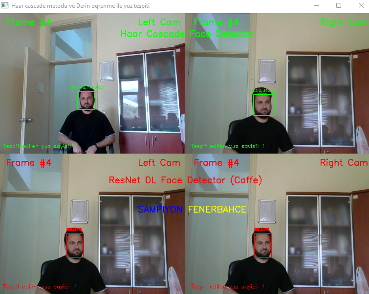

# EESEC-448 GÖRÜNTÜ İŞLEME


## Proje 1: Resim Yükleme ve Görüntüleme (load-display-image)
### Yüklenen Resmin Üzerine Yazı Yazma, Resmi Yeniden Boyutlandırma, Ekranda Görüntüleme ve Dosyaya Kaydetme


## Proje 2: Web Kamerası (web-cam-stream)


## Proje 3: Filtreleme (filtering)


## Proje 4: Görüntü İşleme Hızını Hesaplama


## Proje 5: Piksel Şiddet Değerleri, Renk Uzayları (RGB - Gri Ton - Siyah Beyaz)


## Proje 6: NumPy Kullanarak Sentetik Resim Oluşturma, Resimleri Birleştirme, Kendi Eşik Fonksiyonumuzu Yazma ve OpenCV ile Hız Bakımından Kıyaslama

## Ödev2

```
# Written By Onur Yetim
import cv2
import numpy as np

print('[BİLGİ] Yüz Tespiti için Haar Cascade yükleniyor...')
detector = cv2.CascadeClassifier('haarcascade_frontalface_default.xml')
print("[BİLGİ] Yüz tespiti için derin öğrenme modeli olan ResNet Caffe'den yükleniyor...")
net = cv2.dnn.readNetFromCaffe('deploy.prototxt.txt', 'res10_300x300_ssd_iter_140000.caffemodel')
conf = 0.5 # minimum probability to filter weak detections
k = 0 

for i in range(47,114): # furkan-data-1 için 66, furkan-data-2 için 47,114,1
    img1 = cv2.imread('onur-data-2/left cam %i.jpg' %i)
    img2 = cv2.imread('onur-data-2/right cam %i.jpg' %i)
    img3 = cv2.imread('onur-data-2/right cam %i.jpg' %i)
    img4 = cv2.imread('onur-data-2/right cam %i.jpg' %i)
    k +=1
    (h,w,c) = img1.shape
    stereo = np.zeros((2*h,2*w,c), np.uint8)
    gray1 = cv2.cvtColor(img1, cv2.COLOR_BGR2GRAY)
    gray2 = cv2.cvtColor(img2, cv2.COLOR_BGR2GRAY)
    rects1 = detector.detectMultiScale(gray1, scaleFactor=1.05, minNeighbors=25)
    rects2 = detector.detectMultiScale(gray2, scaleFactor=1.05, minNeighbors=25)
    
    img1 = cv2.putText(img1, 'Left Cam' , (480,40), 0, 1, (0,255,0), 2, 0)
    img2 = cv2.putText(img2, 'Right Cam', (460,40), 0, 1, (0,255,0), 2, 0)
    img3 = cv2.putText(img3, 'Left Cam' , (480,40), 0, 1, (0,0,255), 2, 0)
    img4 = cv2.putText(img4, 'Right Cam', (460,40), 0, 1, (0,0,255), 2, 0)
    img1 = cv2.putText(img1, 'Frame #%i'  %(k), (30,40), 0, 1, (0,255,0), 2, 0)
    img2 = cv2.putText(img2, 'Frame #%i'  %(k), (30,40), 0, 1, (0,255,0), 2, 0)
    img3 = cv2.putText(img3, 'Frame #%i'  %(k), (30,40), 0, 1, (0,0,255), 2, 0)
    img4 = cv2.putText(img4, 'Frame #%i'  %(k), (30,40), 0, 1, (0,0,255), 2, 0)
    #
    blob1 = cv2.dnn.blobFromImage(cv2.resize(img3, (300, 300)), 1.0,
		(300, 300), (104.0, 177.0, 123.0))
    blob2 = cv2.dnn.blobFromImage(cv2.resize(img4, (300, 300)), 1.0,
		(300, 300), (104.0, 177.0, 123.0))
	# pass the blob through the network and obtain the detections and predictions
    net.setInput(blob1)
    detections1 = net.forward()
    net.setInput(blob2)
    detections2 = net.forward()
    cv2.putText(img3, 'Tespit edilen yuz sayisi: %i' %len(detections1), (20,460), 2, 0.6, (0,0,255), 1)
    cv2.putText(img4, 'Tespit edilen yuz sayisi: %i' %len(detections2), (20,460), 2, 0.6, (0,0,255), 1)
    
    # tespit edilen yüzleri dikdörtgen olarak çiz ve piksel koordinatlarını yaz
    for (x,y,width,height) in rects1:
        cv2.rectangle(img1, (x,y), (x+width,y+height), (0,255,0), 2)
        cv2.putText(img1,'(%.2f,%.2f)' %(x+width/2,y+height/2),(x-30,y-10),2,0.45,(0,255,0),1)
    cv2.putText(img1, 'Tespit edilen yuz sayisi: %i' %len(rects1), (20,460), 2, 0.6, (0,255,0), 1)
    for (x,y,width,height) in rects2:
        cv2.rectangle(img2, (x,y), (x+width,y+height), (0,255,0), 2)
        cv2.putText(img2, '(%.2f,%.2f)' %(x+width/2,y+height/2), (x-30,y-10), 2, 0.45, (0,255,0), 1)
    cv2.putText(img2, 'Tespit edilen yuz sayisi: %i' %len(rects2), (20,460), 2, 0.6, (0,255,0), 1)
    
    # loop over the detections
    for i in range(0, detections1.shape[2]):
		# extract the confidence (i.e., probability) associated with the prediction
        confidence = detections1[0, 0, i, 2]
		# filter out weak detections by ensuring the `confidence` is
		# greater than the minimum confidence
        if confidence < conf:
            continue
		# compute the (x,y)-coordinates of the bounding box for the object
        box = detections1[0, 0, i, 3:7] * np.array([w, h, w, h])
        (startX, startY, endX, endY) = box.astype("int")
		# draw the bounding box of the face along with the associated probability
        text = "{:.2f}%".format(confidence * 100)
        y = startY - 10 if startY - 10 > 10 else startY + 10
        cv2.rectangle(img3, (startX,startY), (endX,endY), (0, 0, 255), 2)
        cv2.putText(img3, text, (startX,y), cv2.FONT_HERSHEY_SIMPLEX, 0.45, (0, 0, 255), 2)
        
    for i in range(0, detections2.shape[2]):
		# extract the confidence (i.e., probability) associated with the prediction
        confidence = detections2[0, 0, i, 2]
		# filter out weak detections by ensuring the `confidence` is
		# greater than the minimum confidence
        if confidence < conf:
            continue
		# compute the (x,y)-coordinates of the bounding box for the object
        box = detections2[0, 0, i, 3:7] * np.array([w, h, w, h])
        (startX, startY, endX, endY) = box.astype("int")
		# draw the bounding box of the face along with the associated probability
        text = "{:.2f}%".format(confidence * 100)
        y = startY - 10 if startY - 10 > 10 else startY + 10
        cv2.rectangle(img4, (startX,startY), (endX,endY), (0, 0, 255), 2)
        cv2.putText(img4, text, (startX,y), cv2.FONT_HERSHEY_SIMPLEX, 0.45, (0, 0, 255), 2)       
    # resmi göster
    stereo[0:h,0:w,:] = img1
    stereo[0:h,w:2*w,:] = img2
    stereo[h:2*h,0:w,:] = img3
    stereo[h:2*h,w:2*w,:] = img4
    s = 0.6
    rstereo = cv2.putText(stereo, 'Haar Cascade Face Detector', (420,80), 0, 1, (0,255,0), 2, 0)
    rstereo = cv2.putText(stereo, 'ResNet DL Face Detector (Caffe)', (380,580), 0, 1, (0,0,255), 2, 0)
    rstereo = cv2.putText(stereo, 'SAMPIYON ', (480,680), 0, 1, (255,0,0), 2, 0)
    rstereo = cv2.putText(stereo, 'FENERBAHCE ',  (650,680), 0, 1, (0,255,255), 2, 0)
    rstereo = cv2.resize(stereo, (int(s*stereo.shape[1]), int(s*stereo.shape[0])), cv2.INTER_LINEAR)
    cv2.imshow('Haar cascade metodu ve Derin ogrenme ile yuz tespiti ', rstereo) 
    if cv2.waitKey(1) == 27: # ESC'ye basınca çık
        break
cv2.destroyAllWindows()

```


## Messi-Ronaldo

```
import cv2
detector = cv2.CascadeClassifier('haarcascade_frontalface_default.xml')
resim = cv2.imread('messi ve ronaldo.jpg')
griResim = cv2.cvtColor(resim, cv2.COLOR_BGR2GRAY)
rects = detector.detectMultiScale(griResim, scaleFactor=1.25, minNeighbors=5, minSize=(30, 30), flags=cv2.CASCADE_SCALE_IMAGE)
k = 0 # tespit edilen yüz sayısı
isim = ['Messi', 'Ronaldo'] # oyuncuların isimlerini dikdörtgenin sol üst köşesinden x ekseninde kaydır
isimKaydirX = [80, 85]
for (x, y, w, h) in rects: # tespit edilen yüzleri dikdörtgen içine al ve oyuncunun ismini yazdır
    cv2.rectangle(resim, (x, y), (x + w, y + h), (0, 255, 255), 2)
    resim = cv2.putText(resim, isim[k], (x-isimKaydirX[k], y+int(h/4)), cv2.FONT_HERSHEY_SIMPLEX, 0.65, (0, 255, 255), 1, cv2.LINE_AA)
    k = k + 1 # tespit edilen yüz varsa artır
yazi0 = 'Resimde %i tane yuz tespit edildi' %k
resim = cv2.putText(resim, yazi0, (10, 20), cv2.FONT_HERSHEY_SIMPLEX, 0.65, (0, 255, 255), 1, cv2.LINE_AA)
yazi1 = 'Yukseklik = %i piksel' %resim.shape[0]
yazi2 = 'Genislik = %i piksel' %resim.shape[1]
resim = cv2.putText(resim,yazi1,(550, 20), cv2.FONT_HERSHEY_SIMPLEX, 0.65, (0,255,255), 1, cv2.LINE_AA)
resim = cv2.putText(resim,yazi2,(550, 40), cv2.FONT_HERSHEY_SIMPLEX, 0.65, (0,255,255), 1, cv2.LINE_AA)
cv2.imshow('yuz tespiti', resim)
cv2.waitKey(0) # kullanıcı bir tuşa basana kadar ekranda görüntüle
cv2.imwrite('ronaldo and messi annotated.jpg', resim, [cv2.IMWRITE_JPEG_QUALITY, 100])

```


## Elon-Musk

```
import cv2
import numpy as np

resim = cv2.imread('Elon_Musk.jpg')
resimGray = cv2.cvtColor(resim, cv2.COLOR_BGR2GRAY)
(T,resimBW1) = cv2.threshold(resimGray, 50,  255,  cv2.THRESH_BINARY)
(T,resimBW2) = cv2.threshold(resimGray, 100, 255, cv2.THRESH_BINARY)  
(T,resimBW3) = cv2.threshold(resimGray, 150, 255, cv2.THRESH_BINARY)

(h,w)=resimGray.shape
resim = np.zeros((h,3*w), np.uint8)
resim [:,0:w] = resimBW3
resim [:,w:2*w] =resimBW1
resim [:,2*w:3*w] =resimBW2

resim = cv2.putText(resim, '(1)', (30,50), 1, 1, (0,0,0), 2, 0)
resim= cv2.putText(resim, '(2)', (w+30,50), 1, 1, (0,0,0), 2, 0)
resim= cv2.putText(resim, '(3)', (2*w+30,50), 1, 1, (0,0,0), 2, 0)

s = 0.1
imgGrayResized = cv2.resize(resimGray, (int(s*resimGray.shape[1]/2), int(s*resimGray.shape[0]/2)), 0)


cv2.imwrite('elon musk binary.jpg', resim,[cv2.IMWRITE_JPEG_QUALITY,100])
cv2.imshow('elon musk binary', resim) 
cv2.waitKey(0) 

```

